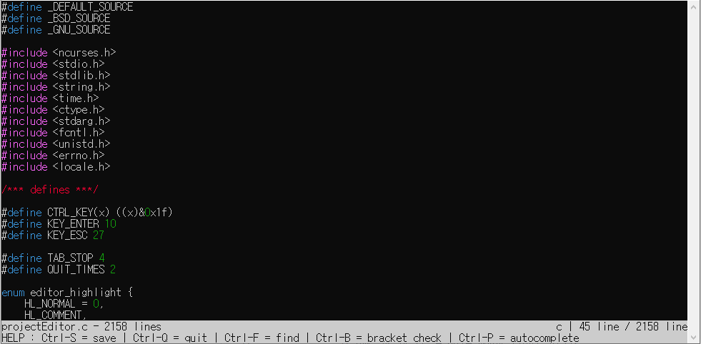
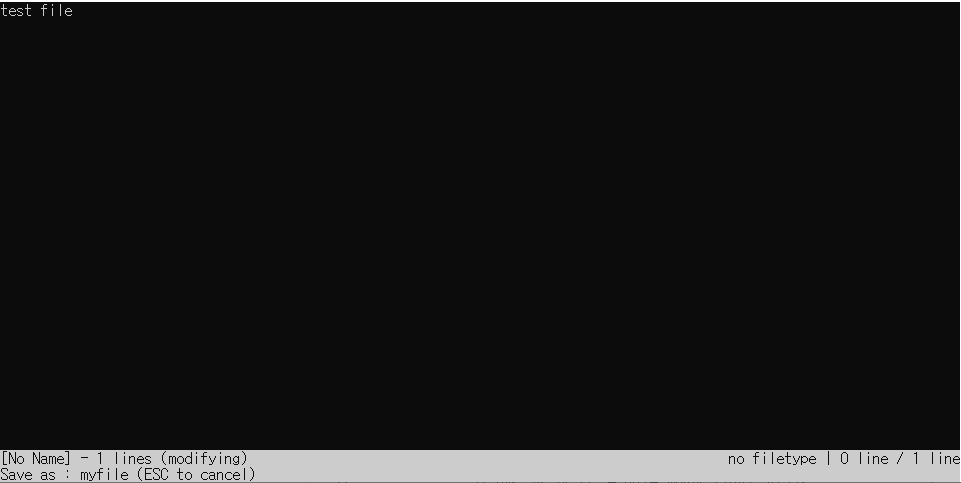
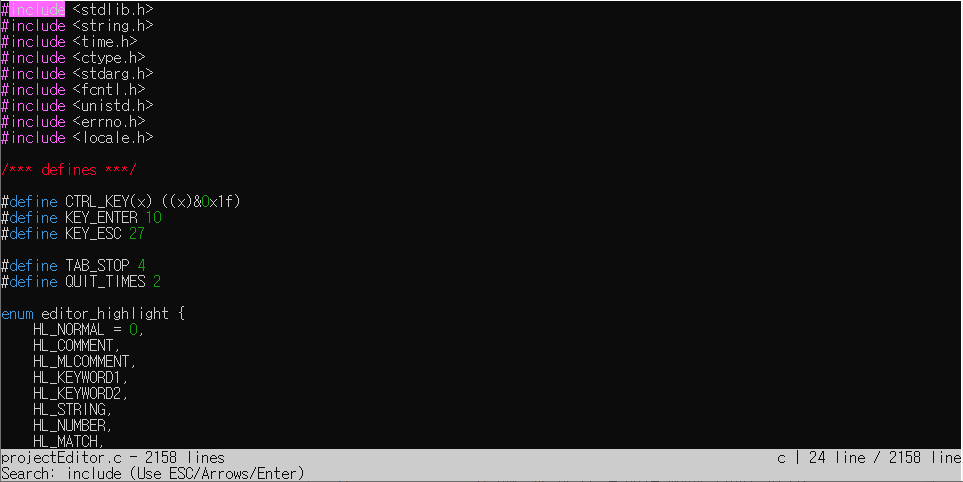
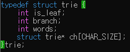
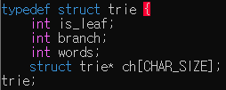
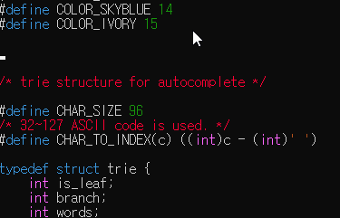

# 2021-1 Sogang Univ. Data Structure(Prof. JiHoon Yang) Team Project

## A simple text editor with ncurses

- Original content : Build Your Own Text Editor by Paige Ruten  https://viewsourcecode.org/snaptoken/kilo/index.html
- Used ncurses instead to terminal interaction
- Syntax highlighting for C and C++ by ncurses
- Fast search using KMP algorithm
- Checking parentheses pair by stack data structure
- Autocompletion by trie data structure

## Execution

Need GCC and ncurses.

`cc projectEditor.c -lncurses`

Then execute `./a.out`. 

If you want to open a file, then give the parameter to the execution file.

Ex) `./a.out projectEditor.c` will open the text editor code file itself.

## Start

If you did not give a file name parameter when executing the text editor, then you will see the start screen. Press Enter key to start with an empty file.

If you open a file with the text editor, you will immediately see the content of the file.

For example, if you open a text editor code file itself, you will see the content like this.

As you can see, syntax highlighting for certain keywords works fine.

## Edit & Save

You can edit the text of the file as common text editors.

And you can save the change of the file by `Ctrl+S` key.

If you started from the empty file, then you can make a new file and save the content you made.

When you save the file, editor will notice you the bytes of the file you saved.

## Quit

You can quit the editor by `Ctrl+Q`.

If the file has unsaved change, then warning message will come. You can force to quit by pushing `Ctrl+Q` 3 times more.

## Find

You can fine the keyword you want. By the KMP algorithm, you can find the long keyword in the long text in very high speed. The keyword you find will be highlighted in pink. And you can see the previous/next search by the UP/DOWN arrow key.

Key for search is `Ctrl+F`

Example) Searching the keyword `include`

## Bracket Pair Check

You can check the bracket pair `{}` by using the key `Ctrl+B`

If the pair is right, bracket pair will be highlighted in green.

Otherwise, such bracket(In other words, bracket pair is not coupled) will be highlighted in red.

## Autocomplete

You can autocomplete the variable/function name by pushing the `Ctrl+P` at the end of the word you wrote. The editor automatically parse the function/variable name you used.

## Team members

SungHyun Kim(https://github.com/witch-factory)

JiEun Kwon(https://github.com/lectura7942)

